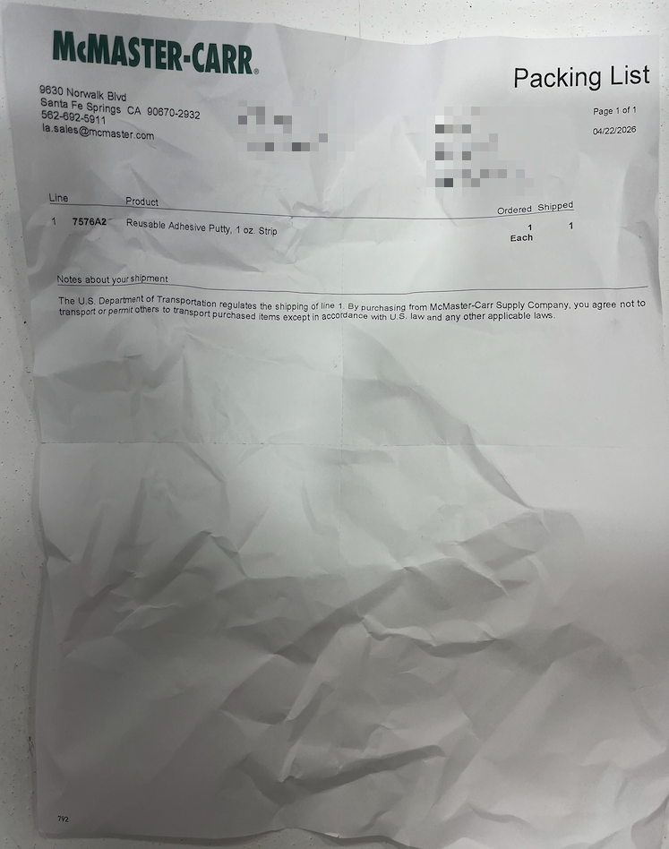

# Coding Challenge

## Overview

Many hardware companies receive dozens of packing lists per day and it becomes
time-consuming to manually track what parts have been received and what's still
on the way. The goal is to make a simple app that allows users to upload a
picture of a packing list and return / display structured data for all line
items on the packing list to the user. This data could later be used in an
internal purchasing management system to track the status of each order (out of
scope for this challenge).

## Deliverables

- A link to a public demo of your app.
- The source code for your app shared privately via a GitHub repository or zip
  file.

## Notes

- You don't need to go crazy with backend infra. Even a database / document
  storage isn't strictly necessary but if you want to use one that's totally
  fine.
- The coding challenge is deliberately open-ended. We're looking for you think
  about the problem and consider what features you might like to have in the
  app. Feel free to make any assumptions you need in order to move forward.
- A barebones frontend has been created to get you started. Feel free to use it
  or not and make any change you'd like.
- /examples contains some example packing lists that you can use to test your
  app.

## Example Packing List

